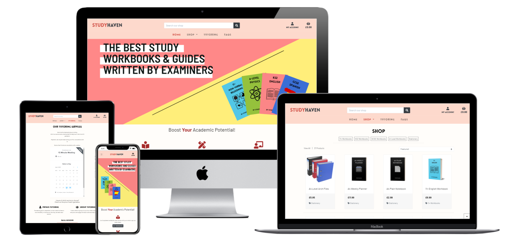
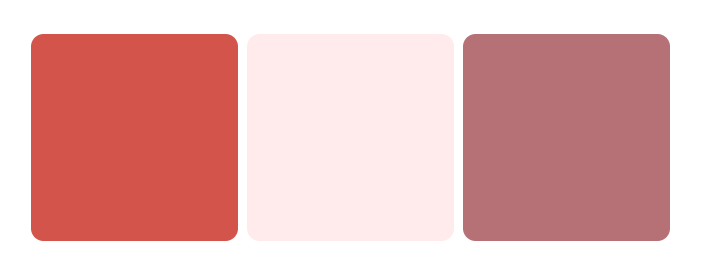
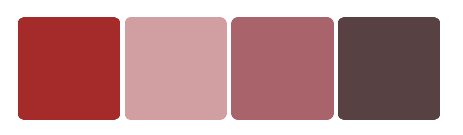
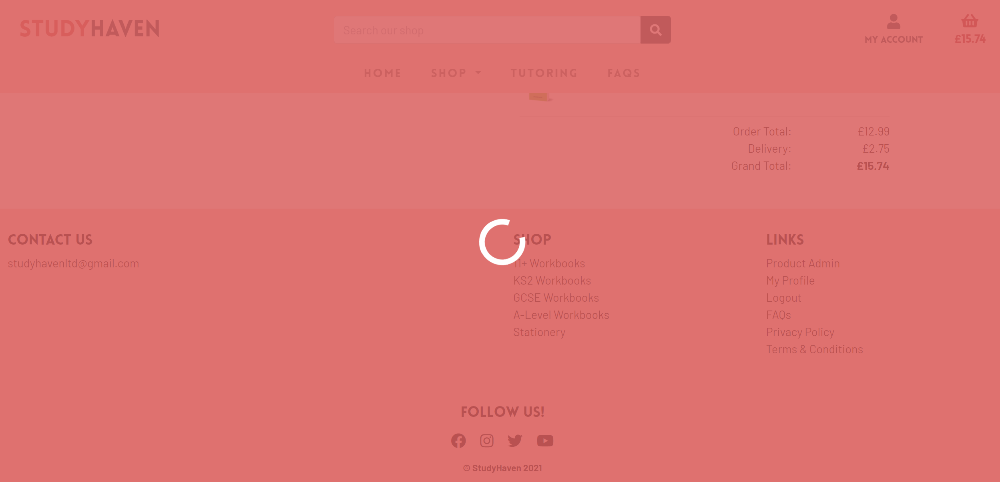
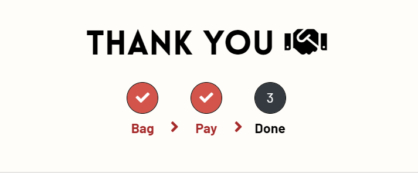

# StudyHaven
Welcome to StudyHaven! This is an app that will reassure your capability for academic success. Aimed at students of ages 7 - 18 years, StudyHaven provides top quality stationery to aid studying, details exam question written by former examiners and professional tutors who carry evidence of high performance in there academia. This is the place to get the very best out of your learning whilst knowing you can rely on attaining the necessary studying equipment and materials to become the best student you can be. 

StudyHaven is deployed to Heroku and can be accessed [here](https://studyhaven.herokuapp.com/).

## 1. User Experience
Ideas for the application were divided into three. Even though users have their own goals when visiting the site, it was worth aligning them with the business goals (i.e. those of the site and store owners).
### 1.1. Strategy Phase

With the pandemic shutting down schools and cancelling exams yet students were still being graded in a totally unexpected manner, their panic was inevitable. The aim of StudyHaven is to offer a safe space to provide assistance to students' learning. I decided to ask students what type of things would they like to see in an e-commerce website focused in education. As the store owner, I was aligned with their viewpoint of having a range of affordable custom-made study resources and stationery to alleviate any stress they may have. Then I met with former examiners and high-performers across a period of 2 months to develop a bespoke StudyHaven syllabus for the most popular subjects that students are struggling with right now. These subjects are:

11 Plus (Ages 7 - 11):
- Mathematics
- English
- Verbal Reasoning
- Non-Verbal Reasoning

KS2 (Ages 7 - 11):
- Mathematics
- English

GCSE (Ages 11 - 16):
- Biology
- Business Studies
- Chemistry
- Computer Science
- Economics
- French
- Mathematics
- Physics
- Spanish

A-Level (Ages 16 - 18):
- Biology
- Business Studies
- Chemistry
- Computer Science
- Economics
- French
- Mathematics
- Physics
- Spanish

Please note that StudyHaven is looking into writing books for more subjects in the future but will always be primarily based on user demand.

### 1.2. Scope Phase

Following on from the stategy phase, it was imperative to develop user stories for which the development of StudyHaven will largely depend on. You can find the full list of user stories in Section 1.6.

__Functional Requirements:__

StudyHaven must...
- Sell products and they should be able to be categorised them. There should be a relationship between the product and the category in order to run a consistent theme across all products within a set category. 
- Handle orders without users being taken to an external site to make purchase otherwise this goes against its purpose of serving as an e-commerce website.
- Offer extra services beyond selling books and stationery to differentiate it from any regular academic e-commerce store.

__Content Requirements:__

StudyHaven must...
- Make students be welcomed or drawn into the website by the choice of colours and fonts.
- Have a responsive website that displays information on any device. This makes it way more accessible, appealing and interactive for the younger generation.
- Display High quality product images to aid in selling the products that they apply to.

### 1.3. Structure Phase
__Interaction Design__
- Following on from the functional requirements above, the user must be able to make the order themselves and at their own speed. This allows them more control in the whole process.
- Any information or message that is displayed after various activities should be displayed in order to help the user keep themselves on track during their site visit.
- Any message should be closed at the request of the user to ensure that they have read the information and take control of their next thoughts and actions based off of it.
- Good interaction design will ensure that products are not easily deleted from the site but there must be a verification process to which the user must press confirm. This could be in the form of a modal.

__Information Architecture__
- Ensure that the product images being displayed are close to their descriptions so that the subconscious can make a logical relationship between the two pieces of product information.
- Utilise Bootstrap grid system particularly on small devices to structure content in a way that encourages padding and limits information overload.
- There should be the ability to scroll back to top in the user is scroll through a long page of products or text.
- The user should be able to make a quick search for products whenever they feel like without have to click links to get there. So it will be helpful if the search bar is accessible in the footer and/or the header (depending on the device).
- When it comes to payment, the most important question is _"How much am I going to pay?"_. So the answer to this question must stand out on the page so that it is clear to the user.

### 1.4. Skeleton Phase
In order to encompass Interface Design, Navigation Design and Information Design, I created wireframes for the website. The [StudyHaven wireframes](https://github.com/jerhabor/studyhaven/blob/ecbfc696bc26739225b683638529b6a301392985/static/wireframes/studyhaven-wireframes.pdf) listed the following pages:

1. Home
2. My Profile
3. Product Admin
4. FAQs
5. Tutoring
6. Register
7. Login
8. Products
9. Product Info
10. Checkout - Shopping Bag
11. Checkout - Contact Information
12. Checkout - Payment
13. Checkout - Order Summary

Please note that the names of the wireframed pages may change for the real application during the course of the development. This could be due to fact that the name should be a solid representation of the information being delivered to the user. Clarity at first sight is attractive.

### 1.5. Surface Phase

The wireframes could only provide assistance with the relationship and structure of information and so it is difficult to also portray extra key information such as the mood of the site, the choice of colours, the fonts and the overall appeal.

#### 1.5.1. Colour theme
The word _"haven"_ means _"a safe place"_. A safe place or refuge is a place that puts someone at ease and makes them feel welcome. So I wanted warm colours that would instantly express this.

According to [Art Therapy](http://www.arttherapyblog.com/online/color-psychology-psychologica-effects-of-colors/#warmcolors), the colours associated with warmth are Red, Orange, Yellow, Brown and Pink. I decided to play around with colour palettes and aligned the intended feel of the colours with the site goals mentioned in the previous phases of UX design.






Common colours from the palettes that I thought would present a welcoming aura as users visit StudyHaven are: [`#fdd9cc`](https://www.colorhexa.com/fdd9cc), [`#d2544a`](https://www.colorhexa.com/d2544a) and [`#A52A2A`](https://www.colorhexa.com/a52a2a).

#### 1.5.2. Font styling
A bold font is one that would capture the attention of users. Seeing as the audience are classed as the younger generation, there needs to be an element of creativity to the style; one that gives a captivating but also not too distracting so that the user focus is aligned with the designed intention described in earlier sections above.

I came across a custom font called `Lovelo` which is youthful and great for branding:


### 1.6. User Stories

With many attempts in redrafting the wireframes, the following user stories were deemed to be essential. This means that in the wireframes, the "Best Selling Product" and "Subscribe to Mailing List" features are not needed right now in the first release of the StudyHaven app and can therefore be omitted in the development of this project going forward.

#### 1.6.1. Customer User Stories

User Story 1:
> As a customer, I would like to be able to make payment no more than 2 clicks after viewing items in my shopping bag.

User Story 2:
> As a customer, I would like to be able to view my order history in order to keep track of my payments.

User Story 3:
> As a customer, I would like to be browse through shop and add them to bag.

#### 1.6.2. Site User Stories

User Story 4:
> As a site user, I would like the site to be responsive enough that I should not have to scroll horizontally to see tables/content.

User Story 5:
> As a site user, when registering I would like to see options that verify my inputs.

User Story 6:
> As a site user, I would like to be able to easily save my address details after a purchase to which I could reuse automatically.

#### 1.6.3. Site Owner Stories

User Story 7:
> As a site owner, I would like to be able to add products regardless of whether they have an image or not.

User Story 8:
> As a site owner, I would like to be able to edit products freely.

User Story 9:
> As a site owner, I would like to be able to delete any unwanted or expired products.

User Story 10:
> As a site owner, I would like to be able prevent any site user or hacker from bypassing the site urls.

## 2. Features
### 2.1. General Features

#### 2.1.1. Base Elements
- Navigation Bar - a light coloured navigation bar has been chosen for the StudyHaven application complimenting the background used for the section elements and making the links legible for users. The navigation bar consists of a search bar, links to the different application pages, my account links to login/register page (when not logged in) or my profile and logout my account and shopping basket (when logged in). An additional link via My Account is Product Admin, this link is available when a user with admin access level has logged in. This navigation bar is responsive, working well on different screen sizes and browsers. At a screen width between 576px and 991px, it displays the Brand name, My Account section and shopping basket link, with the application pages collapsed into a dropdown list. At a screen width of 575px or below, the My Account icon and links also join the dropdown list with the application pages. This is the view of the navigation bar on mobile screens.
- Search Bar - allow users to browse through products available in the online shop also via the search. The search input into the search bar will be displayed in the Shop page. For example, if a user typed the letter 'w' in the search bar, all results for this search will be displayed on the shop page with a caption of the number of products found for the search input "w".
- Footer - a light coloured footer also complimenting the background used for the section elements. The footer has a Contact Us section, Shop section and a Links section.
  - The Contact Us section has an email mailto: link provided, so that when a user clicks on this email, they will be redirected to the Microsoft Outlook app where they can begin composing an email to the address provided. The footer consists of social media links for Facebook, Instagram, Twitter and YouTube.
  - The Shop Section includes all the categories of the products available for sale on the website. Currently, there are five categories - 11+ workbooks, KS2 Workbooks, GCSE Workbooks, A-Level Workbooks and Stationery. Selecting any of the categories in this section, will allow the user to see a filtered view from the Shop tab of the selected category. For example, the 11+ Workbook category will display all 11+ Workbooks available for sale on the site.
  - The Links section (prior to when a user is logged in), includes a login link, a register link, links to the FAQs page, privacy policy and terms & conditions statements. When a user is logged in Product Admin and My Profile and Logout links will now appear in this section and the login and register links are no longer available.

#### 2.1.2. Home Page
- Carousel Header - consists of pink and yellow varied background styles, to once again compliment the colours used in the rest of the application. There are snapshots of some of the products available on the site, making this section both visually appealing and educative.
- Sales Section - this section acts as a guide to help users as they explore the site to learn on the key products and services being offered by StudyHaven. There is an appropriate use of font awesome icons here to describe some of key areas - Workbooks, Stationery and Tutoring services. The Buy Workbooks and Buy Stationery buttons provide users with filtered view of the products available.
- Testimonials - found on the home page in Our Customers' Reviews section, displays reviews from customers from buying products from the StudyHaven site or from using the StudyHaven tutoring services.

#### 2.1.3. Shop Page
- Filter Tags - underneath the Shop heading there are currently five product categories, these are also listed in the Shop section of the footer. When a user clicks on a filter tag, the shop results are filtered based on the selected tag. To exit this filter, click the 'View All' link to display all products available on the site for sale.
- Select Box - There are four options available, category A-Z, category(Z-A), Name(A-Z) and Name(Z-A). These options allow users to select their preference on products display method in either ascending or descending order of product category or name.
- Products - all available products are displayed in a thumbnail which consists of a product picture, product name, price and category tag. The Product image is a link which opens up the full view of the product information. For users with admin access level, edit and delete buttons will appear besides the product price.

#### 2.1.4. Product Info Page
- Navigation Breadcrumbs - To help users keep track of where they have navigated to, there are navigation breadcrumbs available on the Product Info page in the format Home > Shop > Product Name. In this case, Home and Shop are links and users can also find their way back to previously visited areas of the site via these breadcrumbs.
- Product image - users can click on the product image to view a close-up of the product perhaps to better analyse sizes and contents. To exit the close-up image view, users can click out of the image.
- Product Information - users can read about more detailed information on the contents of the product here. This section includes information on materials and measurements.
- Quantity Selector - users can select one or more of the product they would wish to buy.
- Buttons - users have the options to either keep shopping or add to bag. If a user selects the Keep Shopping button, they will be returned to the Shop page without any item being added to their shopping basket. If a user selects the Add to Bag button, the selected quantity of the product they are viewing will be added to their shopping basket.

#### 2.1.5. Shopping bag Page
- Bag is the first step in the sale process. Displayed highlighted as point 1 out of 3 at the top of the page.
- Tabular display - for medium to large screen widths the shopping basket is displayed to users in a tabular format. There is a delete button at the end of the table to delete items from the shopping bag.
- Grid display - for small and extra small screen widths will use this grid display to allow a more responsive display of the products added in the shopping basket.
- Bag Summary - includes information on the bag total, delivery cost (if below £22.75), grand total and a red discount alert to let the user know how much more they should spend to qualify for free delivery. For example, if the grand total of a user's shopping basket is £14.65, they would see an alert prompting them to `Spend £8.10 more to get free delivery!`.

#### 2.1.6. Checkout Page
- Pay is the second step in the sale process. Displayed highlighted as point 2 out of 3 at the top of the page. At this stage, the Bag (Point 1 stage) will appear as ticked to show completion.
- Checkout form - The checkout form will require the user to complete contact information, shipping address, and payment details (card number, expiry date and CVC number) to process the payment. Users have the option to save the shipping information they have provided to their profile. This means that next time when performing a checkout this saved information will be pre-filled on the checkout form.

#### 2.1.7. Checkout Success Page
- Done is the third and final step in the sale process. Displayed highlighted as point 3 out of 3 at the top of the page. At this stage, the Bag (Point 1 stage) and Checkout (Point 2 stage) will appear as ticked to show completion.
- Order Summary - this section includes information on the generated order number, order date, product details, shipping address and billing. Below this information are links for the user to either shop for more or navigate to their profile. The order summary will also be sent to the user's registered email and a modal confirmation will appear on the top corner of the page.

#### 2.1.8. Profile Page
- Contact & Shipping Information - user can view and update their details by providing their up-to-date contact information and address. Selecting the update details button, allows users to save their information.
- Order History - users have access to all the orders they make on the site. As they make more orders on the site, a scroll bar will appear to allow a user to scroll through their previous orders. When a user clicks on an order number, they will be redirected to the order summary information for that particular order.

#### 2.1.9. Product Admin Page
- The only feature currently available on this page is the 'Add a Product' form. This form comprises of six fields namely: Category, Product Name, Product Description, Price, Image URL and Image. The last two are not required and the Django template handles this with an `if` statement. 

- A "no-image" picture will be rendered in the event that the superuser does not upload an image or provide an image url. This still makes the product valid as in real life images can be updated as and whenever without affect the sale of the product itself. (Please go to Section 5. Testing for proof of this).

#### 2.1.10. Tutoring Page
- Description of Services - It is important that the message about the services being offered by StudyHaven, are made as clear as possible to alleviate any possible misunderstanding. By displaying the two types of services with font awesome icons, the user will be given a visual reminder of what is being offered and what to expect.

- Calendly Widget - The widget being displayed inline makes booking a consultation effortless. The script associated with this functionality was provided by [Calendly](https://calendly.com/) and was added to the `extra_js` block in the `base` html template.

- Table of Rates - This is being rendered dynamically using the `Review` model (see section 3.2.5. Review Model). Like most rates, it is liable to change depending on the economy and business status so it is easier to allow the superuser to make these edits in the admin which will be immediately reflected back to the template thanks to the view.

#### 2.1.11. FAQs Page
- Accordion - This is rendered by the FAQ Model. The format is standard with the question as the header and the answer hidden in the box but requires the user to click to activate the dropdown. The colours used here were towards the darker end of the spectrum so that the accordion does not blend in with the fixed navigation bar.

### 2.2. Special Features
- Loading Overlay - When customers make a payment, there is an overlay which when loaded will trigger the function to disable the form behind it. This prevents the user from clicking the secure payment button multiple times which could resort to multiple orders and payments:


- Go to Top Button - Appears on pages that are expected to have a lot of information and where scrolling back up could be cumbersome (particularly the case with the small and extra small devices). This adds further user convenience throughout the navigation of the site which is a demonstration of good UX design.

- "Bag to Order Summary" Steps - These steps can be found on the `Bag`, `Checkout` and `Checkout Success` pages. They give the user further indication of the stage of the process that they are at. This encourages a natural sense of hope and anticipation as they can clearly see a beginning and an end to the process. There is also CSS styling with the font awesome check icon upon completion of the previous step.


### 2.3. Future Features

- Possibility to add a check box on the sign up form for users to determine whether they wish to opt in or out of the StudyHaven mailing list. Benefits of opting in would include receiving discount codes.

- As more products may be added, it would be nice to include pagination to prevent excessive scrolling on smaller devices. However due to the current time constraints, this feature could not be added in this release but will be added in the future release.

- With Django AllAuth, there is functionality with the ability to log in with Social Accounts. However, the current style of registration and login still conveniently allows customers to create a secure StudyHaven account.

- With eventual purchases made overtime, a counter can be applied on the order items and data could be drawn from that to render the Best Selling Products container in the home view as initially design in the wireframes.

## 3. Information Architecture
### 3.1. Databases

Due to the intended nature and task of this project, a relational database must be used. Django works with relational databases called SQL.
- Throughout development the SQLite3 database was used to store models.
- For the deployed version on Heroku, the relational database used is PostgreSQL.

### 3.2. Data Models
#### 3.2.1. User Model

__Aim:__ To render out user authentication system allowing users to register, login and other exceptional cases.

- This was provided by Django AllAuth with `django.contrib.auth.models`. This is installed and added to the StudyHaven settings python file.

#### 3.2.2. Order Model

__Aim:__ To render out the user's shipping and contact details to an order summary, Stripe's payment intent and the admin/database.

    class Order(models.Model):

        order_number = models.CharField(max_length=32, null=False, editable=False)
        user_profile = models.ForeignKey(UserProfile, on_delete=models.SET_NULL,
                                        null=True, blank=True,
                                        related_name='order_history')
        full_name = models.CharField(max_length=50, null=False, blank=False)
        email_address = models.EmailField(max_length=254, null=False, blank=False)
        phone_number = models.CharField(max_length=20, null=False, blank=False)
        country = CountryField(blank_label='Country *', null=False, blank=False)
        address_line1 = models.CharField(max_length=90, null=False, blank=False)
        address_line2 = models.CharField(max_length=90, null=True, blank=True)
        city_or_town = models.CharField(max_length=50, null=False, blank=False)
        postcode = models.CharField(max_length=10, null=False, blank=False)
        order_date = models.DateTimeField(auto_now_add=True)
        order_total = models.DecimalField(
            max_digits=8, decimal_places=2, null=False, default=0)
        delivery_cost = models.DecimalField(
            max_digits=4, decimal_places=2, null=False, default=0)
        grand_total = models.DecimalField(
            max_digits=8, decimal_places=2, null=False, default=0)

        original_bag = models.TextField(null=False, blank=False, default='')
        stripe_pi_id = models.CharField(
            max_length=254, null=False, blank=False, default='')
    
#### 3.2.3. Line Order Model

__Aim:__ To render out one order per product from the user's shopping bag; which will then be aggregated in order to reach the grand total.

    class EachLineOrder(models.Model):

        product = models.ForeignKey(
            Product, blank=False, null=False,
            on_delete=models.CASCADE)
        quantity = models.IntegerField(
            default=0, null=False, blank=False)
        order = models.ForeignKey(
            Order, blank=False, null=False,
            on_delete=models.CASCADE,
            related_name='each_line')
        product_order_total = models.DecimalField(
            max_digits=6, decimal_places=2, null=False, 
            blank=False, editable=False)


#### 3.2.4. FAQ Model

__Aim:__ To render out the frequently asked questions in a standard question and response style accordion.

    class FAQ(models.Model):

        question = models.CharField(max_length=254, null=False, blank=False)
        answer = models.TextField()


#### 3.2.5. Review Model

__Aim:__ To render out the Testimonials/reviews received from customers of both the shop and the tutoring services. The date field was added to automatically generate dates to keep track of feedback over a period of dates and allow some possible filtering in the future.

    class Review(models.Model):

        name = models.CharField(max_length=254, null=False, blank=False)
        occupation = models.CharField(
            max_length=254, null=False, blank=False, default='')
        heading = models.CharField(max_length=254, null=False, blank=False)
        description = models.TextField(null=False, blank=False)
        date = models.DateField(auto_now_add=True)

#### 3.2.6. Categories Model

__Aim:__ To render out the categories to enable the filters in the Shop to function. The Shop Name renders the name of each categories whereas the name ensure no space are between words; if category has more than one word in it.

    class Category(models.Model):

        class Meta:
            verbose_name_plural = 'Categories'  # to change data name in admin

        name = models.CharField(max_length=254)
        shop_name = models.CharField(max_length=254, blank=True)

#### 3.2.7. Product Model

__Aim:__ To render out the different products in the StudyHaven shop and allow superuser to add/edit products without uploading an image.

    class Product(models.Model):

        category = models.ForeignKey('Category', null=True,
                                    blank=True, on_delete=models.SET_NULL)
        name = models.CharField(max_length=254)
        description = models.TextField()
        price = models.DecimalField(max_digits=6, decimal_places=2)
        image_url = models.URLField(max_length=1024, blank=True)
        image = models.ImageField(blank=True)

#### 3.2.8. Tutoring Model

__Aim:__ To render out the hourly rates of the StudyHaven tutoring services.

    class TutoringRate(models.Model):

        subject = models.CharField(max_length=254, null=False, blank=False)
        price = models.IntegerField(null=False, blank=False)

## 4. Technologies Used
### 4.1. Languages
- [HTML](https://www.w3schools.com/html/) - Stands for Hypertext Markup Language and it is the backbone of StudyHaven. The latest version (HTML5) - was used to add and structure the site content.
- [CSS](https://www.w3schools.com/css/) - Stands for Cascading Style Sheets. The latest version (CSS3) was used to style all HTML content on the website for enhanced structure and visual appeal.
- [JavaScript](https://www.javascript.com/) - Used to add interactivity to StudyHaven and some backend handling.
- [Python](https://www.python.org/) - Used to handle the backend views, models, forms and admin which will be used to render to the HTML templates.
### 4.2. Tools

- [Balsamiq](https://balsamiq.com/) - Used to create wireframes for the collection of applications.
- [Boto3](https://boto3.amazonaws.com/v1/documentation/api/latest/index.html) - Used to aid in creating and managing AWS S3 Bucket.
- [BrowserStack](https://www.browserstack.com/) - For generating cross browser shots of the site.
- [Canva](https://www.canva.com/) - To produce the carousel images plus the general logo and custom font choice for the site.
- [Django Allauth](https://django-allauth.readthedocs.io/en/latest/installation.html) - To add automated authentication to StudyHaven.
- [Django Countries](https://pypi.org/project/django-countries/) - For the world countries dropdown selection box to send valid two-letter country codes to stripe webhook; needed to process orders.
- [Django Crispy Forms](https://django-crispy-forms.readthedocs.io/en/latest/) - To add structure and style to the Django forms.
- [Django Storages](https://django-storages.readthedocs.io/en/latest/) - Use with Boto3 in AWS S3 Management.
- [Git](https://git-scm.com/) - Version Control System.
- [GitHub](https://github.com/) - A platform to store versions of code, track progress and share with a wider community.
- [GitPod](https://www.gitpod.io/) - The main workspace environment used for the development of StudyHaven.
- [Gunicorn](https://gunicorn.org/) - Needed in order to deploy project to Heroku.
- [Heroku](https://www.heroku.com) - Application hosting platform used in deployment.
- [ImgBB](https://imgbb.com/) - Used to generate urls to the product images to view in full screen in the StudyHaven shop.
- [Pillow](https://pypi.org/project/Pillow/) - Needed to process image files stored in the database.
- [PIP](https://pip.pypa.io/en/stable/) - Used to install the tools listed.
- [Psycopg2](https://pypi.org/project/psycopg2/) - Python adapter used to connect to PostgreSQL.
- [Pylint](https://pypi.org/project/pylint/) - Used to check any code that violates PEP8.
- [Stripe](https://stripe.com) - Used to securely make orders on site by validating card payments.
- [TechSini](https://techsini.com/) - To generate the devices mockup at the top of the README.

### 4.3. Framework & Libraries
- [Bootstrap](https://getbootstrap.com/) - Provides further styling and interactivity to the web page including the structure of HTML elements.
- [Django](https://www.djangoproject.com/) - Python Framework used to develop full stack applications and quickly render more high-quality dynamic template pages easily.
- [Font Awesome](https://fontawesome.com/) - Used to load special icons to bring a bit more animation to the HTML content.
- [Google Fonts](https://fonts.google.com/) - Used to access all other fonts used in the entire application.
- [JQuery](https://jquery.com/) - JavaScript Framework used in DOM manipulation and easy selection of IDs and classes and add more site interactivity.

### 4.4. Databases
- [SQLite3](https://docs.python.org/3/library/sqlite3.html) - Used locally for the development database by Django.
- [PostgreSQL](https://www.postgresql.org/) - Used for the deployed database by Heroku.

### 4.5. Other
- The custom `Lovelo` font was inspired by a font on canva but designed and downloaded for custom use in the branding of StudyHaven.

## 5. Testing
The full documentation on testing can be found in [testing.md](https://github.com/jerhabor/studyhaven/blob/2fbacae2a8d75e9e06540c36b6524ca84e1b1a14/testing.md).

## 6. Deployment

### 6.1. Running Project Locally
1. Make a clone of this project by going to [https://github.com/jerhabor/studyhaven](https://github.com/jerhabor/studyhaven).

2. Select `Clone` dropdown menu and click GitHub CLI. Then copy and paste the command. Insert this command into your workspace terminal.

3. Ensure that a virtual environment is present. This is needed for the Python Interpreter. For further information on this please click [here](https://docs.python.org/3/library/venv.html).

4. Ensure that you have `pip` installed. Then type the following command to ensure all of the app dependencies are installed:
`pip install -r requirements.txt`.

5. In your environment variables, add the following settings:
_(Please note that as you are running locally the URL will be different so another webhook endpoint must be generated for this URL. With this you will receive a different `STRIPE_WH_SECRET` value to that of the deployed version on Heroku)_

|        Key        |                          Value                          |
|:-----------------:|:-------------------------------------------------------:|
|    DEVELOPMENT    |     < Can be set to True only when running locally >    |
|     SECRET_KEY    | < A different key to Heroku from Django Key Generator > |
| STRIPE_PUBLIC_KEY |             < Your Stripe Publishable Key >             |
|  STRIPE_WH_SECRET |             < Your Stripe WH Endpoint Key >             |
| STRIPE_SECRET_KEY |                < Your Stripe Secret Key >               |

6. To migrate, type in the following command into your terminal: `python3 -m migrate`.

7. Create a new superuser in order to access the admin on this development version of the app using the following command:
`python manage.py createsuperuser`

8. Can now finally run the project using: `python manage.py runserver`.

9. To access the admin, simply type `/admin` after the url in the address bar and then log in with the superuser details you created earlier.

### 6.2. Deployment to Heroku

1. Ensure that you have set up a new app on Heroku. If not, create a new app and select the region applicable or closest to you.

2. Click on the `Resources` tab and in the add-on search bar, type Postgres and add the free version. This will generate a database URL.

3. In your workspace, freeze all requirements using the following command: ``` pip3 freeze > requirements.txt ```

4. Create a Procfile using the following command: ``` echo web: python app.py > Procfile ```

5. Go back to Heroku, click deploy and select 'Connect to GitHub'. Continue the necessary steps to connect to your GitHub repository. Allow automatic deploy from GitHub. 

6. Now click on the `Settings` tab in Heroku and scroll down and click `Reveal Config Vars`. Ensure that the follow config vars are listed:

|          Key          |                           Value                         |
|:---------------------:|:-------------------------------------------------------:|
|   AWS_ACCESS_KEY_ID   |                < Your AWS Access Key ID >               |
| AWS_SECRET_ACCESS_KEY |                 < Your AWS Secret Key >                 |
|      DATABASE_URL     |              < Your Postgres database URL >             |
|    EMAIL_HOST_PASS    | < Your app password found after two-step verification > |
|    EMAIL_HOST_USER    |                 < Your business email >                 |
|       SECRET_KEY      |              < From Django Key Generator >              |
|   STRIPE_PUBLIC_KEY   |             < Your Stripe Publishable Key >             |
|   STRIPE_SECRET_KEY   |                < Your Stripe Secret Key >               |
|    STRIPE_WH_SECRET   |          < Your Stripe WH endpoint Secret Key >         |
|        USE_AWS        |                < Set to True to use AWS >               |

7. Login into the Heroku Postgres Shell, migrate the models and create a superuser to access the admin in the new Heroku app. For further information please click [here](https://devcenter.heroku.com/articles/heroku-postgresql).

8. Now that the links are in place, `git commit` your changes and push them. They will be uploaded to Heroku. To verify, click the `Deploy` tab in Heroku and view build progress.

9. To access the site, copy and paste the deployed link at the end of the build progress in Heroku, into your browser address bar.

10. To access the admin, simply type `/admin` after the deployed url in the address bar and then log in with the superuser details you created earlier.

## 7. Credit
### 7.1. Content
__Code Credit__
- [Terms and Conditions Generator](https://www.termsandconditionsgenerator.com/) was used to generate the StudyHaven T&Cs.

- [Privacy Policy Generator](https://www.privacypolicygenerator.info/) the sibling website to T&Cs generator, was used to generate the StudyHaven Privacy Policy.

- Part of the development of this project took some inspiration from Code Institute - Boutique Ado, which served as an tutorial in familiarising myself with the basics of Django.

__Media Credit__
- Most of the images in the `stationery` category were sourced from Google. It is worth noting that these were just used for educational purposes only.

### 7.2. Acknowledgement
- My mentor Caleb - for his guidance from conception to deployment and testing.
- My family - for testing the website and providing encouragement and constructive feedback.
- Code Institute Tutors - for their impressive patience whilst guiding me through long debugging sessions.
- The Slack Community - for the open platform.
- Code Institute Course Teachers - for the excellent break down of subject material.

### 7.3. Disclaimer
This project was developed for educational purposes only.