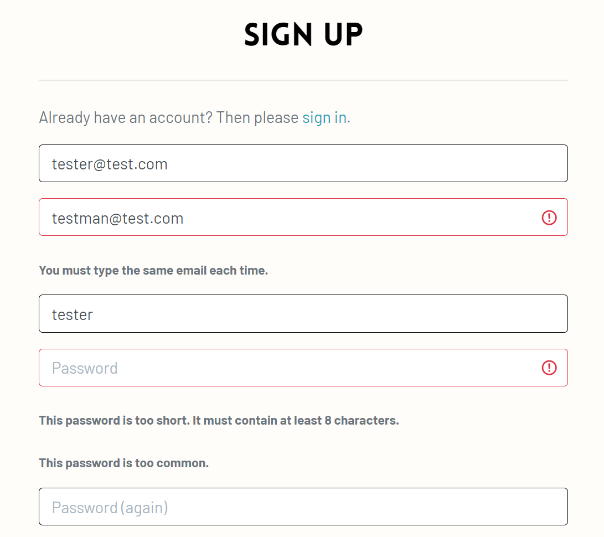
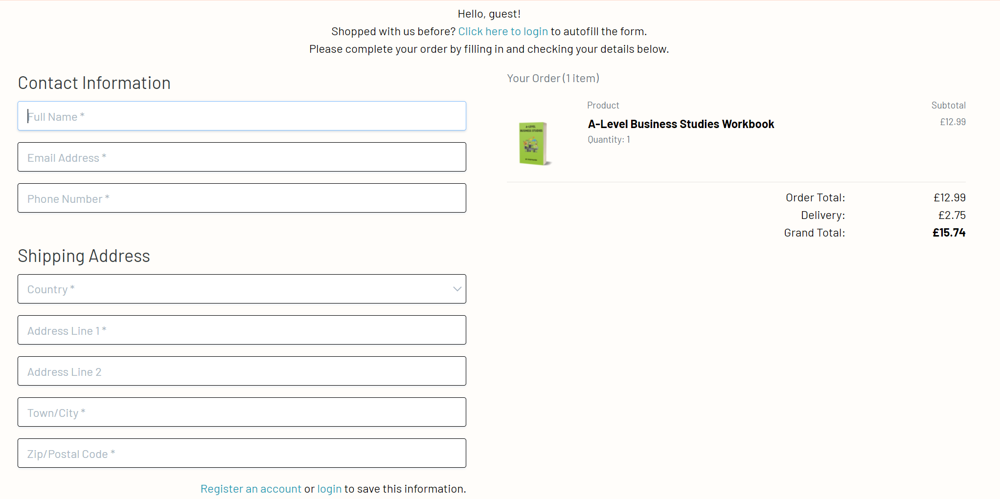
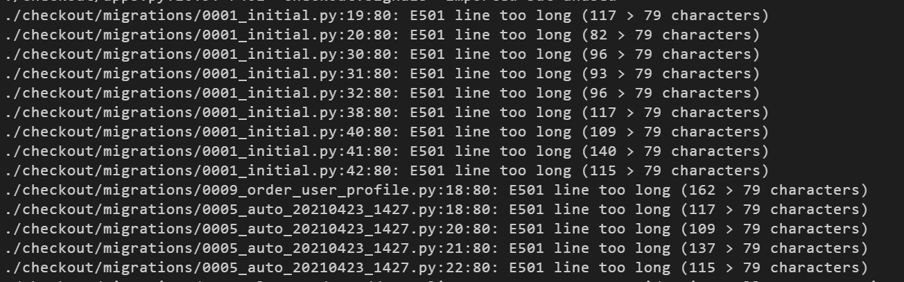
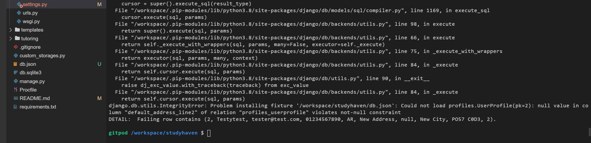

# Testing

## Table of Contents
  * [1. Manual Testing of Features](#1-manual-testing-of-features)
    + [1.1. Create (CRUD Functionalities)](#11-create--crud-functionalities-)
    + [1.2. Read (CRUD Functionalities)](#12-read--crud-functionalities-)
    + [1.3. Update (CRUD Functionalities)](#13-update--crud-functionalities-)
    + [1.4. Delete (CRUD Functionalities)](#14-delete--crud-functionalities-)
  * [2. Automated Testing](#2-automated-testing)
  * [3. Achievement of User Stories](#3-achievement-of-user-stories)
    + [3.1. Customer User Stories](#31-customer-user-stories)
    + [3.2. Site User Stories](#32-site-user-stories)
    + [3.3. Site Owner Stories](#33-site-owner-stories)
  * [4. Code Validation](#4-code-validation)
    + [4.1. Validating HTML Code](#41-validating-html-code)
    + [4.2. Validating CSS Code](#42-validating-css-code)
    + [4.3. Validating JavaScript Code](#43-validating-javascript-code)
    + [4.4. Validating Python Code](#44-validating-python-code)
  * [5. Test on Different Browsers](#5-test-on-different-browsers)
  * [6. Test on Different Devices](#6-test-on-different-devices)
  * [7. Bugs and Problems](#7-bugs-and-problems)
    + [7.1 Solved bugs and problems](#71-solved-bugs-and-problems)
    + [7.2 Unsolved bugs and problems](#72-unsolved-bugs-and-problems)

<hr>

## 1. Manual Testing of Features
### 1.1. Create (CRUD Functionalities)
The Create feature of the site lies in the "Add a Product" feature. Only the site owner can perform this.

__How to add a product to the shop:__

1. Sign in as a superuser
2. Click or hover over "My Account" to initiate dropdown and select "Product Admin".
3. Populate the input fields; the choose image and image_url fields are not compulsory.
4. Click Add Product and be redirected to the newly added product's info page in the shop.

Please see section 3.3. User Story 7 for images as proof of these steps.

As a site user or customer, their create functionalities are limited to adding items to their shopping bag within their session

__How to add a product to the shopping bag:__

1. Go to Shop either by clicking the "Shop" navigation menu link, using the search bar for a search criteria or by typing "https://studyhaven.herokuapp.com/shop" in the browser address bar.
2. Click on a desired product to open the product info page.
3. Select quantity from the page.
4. Click the "Add to Bag" button underneath
5. A toast message displaying the bag preview will be present in the top right corner of the screen near the shopping bag.
6. Click "View Shopping Bag" on this toast message or if closed, click the bag icon in the top right corner.
7. The desired item is now placed in the bag with the required quantity.

### 1.2. Read (CRUD Functionalities)

All aspects of the website carry readable functionalities from accessing the shop and viewing the products and their product information to viewing one's order summary and history. This proves that the models, forms have all been rendered well through the view to the templates.

Please see section 3. Achieve of User Stories for images as proof of these functionalities.

### 1.3. Update (CRUD Functionalities)

Only a site owner holds the ability to update a product; they are called the Superuser.

__How to update a product:__

1. Sign in as a superuser
2. Go to shop
3. Site Owner should expect to see all product cards with Edit and Delete buttibs.
4. Select Edit and update the product information
5. Click Edit Profile.

Please see section 3.3. User Story 8 for images as proof of these steps.

As a site user or customer, their ability to update is limited to changing the quantity of the products in their shopping bag prior to checkout.

__How to update quantity of item(s) in shopping bag:__

1. Add a few products from the Shop, to the shopping bag following the steps in section 1.1.
2. Click the shopping bag icon at the top right of the screen
3. Under the word "quantity" use the stepper either by typing a value or using add and minus buttons to get to a different quantity.
4. Quantity will only be allowed to be between 1 and 99 inclusive, so ensure a number within this range is chosen.
5. View the subtotal which updates instantaneously with the quantity number stepper (if on mobile, they may need to click enter after entering value before the subtotal updates).

### 1.4. Delete (CRUD Functionalities)

Similarly, only a site owner can delete a product. There were no templates required as this is a just a button functionality. However there is a 2-step process. Clicking the red button will leave superusers with a modal box asking for their confirmation to delete. This is added security to the functionality.

__How to delete a product:__

1. Sign in as a superuser
2. Go to shop or product info page
3. Click the red "Delete" button
4. Press the read delete button again if very sure.
5. Product delete as confirmed by message in the top right.

Please section 3.3. User Story 9 for images as proof of these steps.

As a site user or customer, their delete functionalities are limited to only removing an item from the bag.

__How to remove item from bag:__

1. Add a product to the bag from the Shop following the steps in section 1.1.
2. Go to shopping bag by clicking the bag icon at the top right of the screen.
3. Locate the circular "x" button
4. Click the circular "x" button
5. Product removed from bag as confirmed by toast message after action.

## 2. Automated Testing

The tests.py file in each app will have at least one test written in it; one of which is the ability to render the html page successfully.
I have also tested the python code in the views by simulating actions that a user would encounter on site e.g. adding to bag as a customer, testing the form attributes in the checkout form.

As part of this project being produced for educational reasons, there was a deadline and at the moment as part of the development, 13 tests were written - all of which passed:


I also tried to use `coverage` to help identify further areas to test code as I could within the time frame and assess how much code the tests cover. Beyond the deadline, I will be making even more tests to further assess the robustness of the entire application.

## 3. Achievement of User Stories
### 3.1. Customer User Stories
__User Story 1__
> As a customer, I would like to be able to make payment no more than 2 clicks after viewing items in my shopping bag.

Upon arriving at the shopping bag page, the customer will see the following:


Customer must then scroll through, checking their items if necessary and clicking the button at the bottom:


The next page then shows the customer that they have completed the first step and that this is the last step:


If customer scrolls to the bottom, they will see a field for card details input to pay. This procedure only took 1 click from the shopping bag which is better than what they had requested.


__User Story 2__
> As a customer, I would like to be able to view my order history in order to keep track of my payments.

The order history is found in "My Profile" and this table will always be present to show where orders will be populated. The table automatically populates data with the customer's order. The field include order number, order date and order items and the price paid at the time of purchase.


Confirmation emails are also sent to the customer in the event that they are not a registered site user. This also ensure that customers can keep track of their payments in their own personal inbox.


__User Story 3__
> As a customer, I would like to be browse through shop and add them to bag.

Go to Shop on the Main Navigation and the customer is greeted with all of the StudyHaven products. The customer also has the option to filter them as they please until they reach a favourite. 


The search bar also goes straight to the shop. Once a product is found, adding to bag is as easy as clicking the product for full information and then the "Add to Bag" button.


A message in the top right corner will then be displayed with a preview of the shopping bag contents.


### 3.2. Site User Stories
__User Story 4__
> As a site user, I would like the site to be responsive enough that I should not have to scroll horizontally to see tables/content.

All aspects of the site were relatively straightforward to make responsive apart from the shopping bag table. As a developer, the approach was to divide this table elements into smaller components which will be piled together using Bootstrap's grid.


__User Story 5__
> As a site user, when registering I would like to see options that verify my inputs incase I enter the wrong email or password.

Django-allauth comes with authetication which are easily imported to the whole application. Fortunately, the authetication does require a confirmation for the email address and passwords. The system is also strict on the type of password that should be used.



__User Story 6__
> As a site user, I would like to be able to easily save my address details after a purchase to which I could reuse automatically.

StudyHaven was designed to make things easier and by checking the box underneath the Postcode input on checkout, the details will be stored. However, please note that this is only viewable to registered users. 


Those that have not registered will have an option to register or login instead:



Once payment has gone through, the user can find their contact and shipping details immediately populated on their profile page. 

### 3.3. Site Owner Stories
__User Story 7__
> As a site owner, I would like to be able to add products regardless of whether they have an image or not.

This is possible as in the `Product` model, the `image` and `image_url` fields are not required so therefore they will not be required on the rendered form.


Instead an `if` statement handles the "No Image" display in the event that the site owner does not upload an image:

_(From products.html lines 73-81)_
```

<a href="">
    
</a>

<a href="">
    
</a>

```
Non-required Image Fields vs the required Price fields:


Test product now added to the StudyHaven shop:


Test product info page:


__User Story 8__
> As a site owner, I would like to be able to edit and update products freely.

When the site owner clicks on the blue Edit button on either the product info page or in the shop, they should expect to see the following:


The image above shows an alert message in the top right to keep the site owner informed of the decision that they have made to edit a particular product in the shop.

The site owner can also now change the product image to another of their choice:


Updated product after pressing "Edit Product" being redirected to product info page:


__User Story 9__
> As a site owner, I would like to be able to delete any unwanted or expired products.

Using the test product as an example, the site owner can simply click the red delete button link to be greeted with a confirm delete modal. This add security in the event that the site owner mistakenly pressed the delete button link.


Once the site owner presses delete, a confirmation message is displayed in the top right as the page redirects to the shop.


__User Story 10__
> As a site owner, I would like to be able prevent any site user or hacker from bypassing the site urls.

A custom 404 page has been created for whenever someone types a url that is not part of the site infrastructure:


If a regular registered site user / non-site owner attempts to add a product an error message is displayed:


If an unregistered user attempts to bypass, they will be directed to the login page.

## 4. Code Validation
### 4.1. Validating HTML Code
All templates were checked with [W3 Validator](https://validator.w3.org/)r. However it must be noted that this validator cannot read through the django templating system. In the event that another developer adds to this project, be aware that the errors generated look like this:


However, one can read through the other errors to see if they are major if any. All other semantics within the StudyHaven code written using only HTML, did not pose as major errors in the [W3 Validator](https://validator.w3.org/).

### 4.2. Validating CSS Code
All CSS files were check with [Jigsaw W3 CSS](https://jigsaw.w3.org/css-validator/). The following results were obtained:

__base.css__


__checkout.css__


__profile.css__


### 4.3. Validating JavaScript Code

I used [JSHint](https://jshint.com/) to test all scripts however [JSHint](https://jshint.com/) does not recognize the `$` selector used in JQuery. Neither did it recognise the Stripe function. Apart from that the scripts were vaidated to be well written. All checking resulted in an output like this:


### 4.4. Validating Python Code
To ensure pep8 compliance, the "Problems" tab by the terminal shows areas that I could tidy up and refactor code thanks to `flake8`.

I used the command: `python3 -m flake8` in the terminal to generate a list of errors across the entire application. Some could be solved such as "line too long" however I opted not to edit any migration files or special calculations across the entire app in case it would mess up the infrastructure. The command therefore reports something like this:



## 5. Test on Different Browsers

[BrowserStack](https://www.browserstack.com/screenshots) was used to test StudyHaven on different browsers. Due to the defensive programming, not all parts of the website can be accessed via BrowserStack. You can find screenshots of the Home, Shop, Tutoring and FAQs pages [here](https://github.com/jerhabor/studyhaven/blob/166dba94c5c56e8bd5bd99a73a2c9f9182bed473/static/browser-tests).

The table below, summarizes the website's versatility and compability across the different types of browsers; which any user could use.

Key: ✔ = Website functions as intended

|    Browser (Version)   	| Home 	| Shop 	| Product Info 	| Bag 	| Checkout 	| Profile 	| Order Summary 	| Product Admin 	| Tutoring 	| FAQs 	|
|:----------------------:	|:----:	|:----:	|:------------:	|:---:	|:--------:	|:-------:	|:-------------:	|:-------------:	|:--------:	|:----:	|
|       Chrome (80)      	|   ✔  	|   ✔  	|       ✔      	|  ✔  	|     ✔    	|    ✔    	|       ✔       	|       ✔       	|     ✔    	|   ✔  	|
|      Firefox (74)      	|   ✔  	|   ✔  	|       ✔      	|  ✔  	|     ✔    	|    ✔    	|       ✔       	|       ✔       	|     ✔    	|   ✔  	|
|       Safari (13)      	|   ✔  	|   ✔  	|       ✔      	|  ✔  	|     ✔    	|    ✔    	|       ✔       	|       ✔       	|     ✔    	|   ✔  	|
| Internet Explorer (11) 	|   ✔  	|   ✔  	|       ✔      	|  ✔  	|     ✔    	|    ✔    	|       ✔       	|       ✔       	|     ✔    	|   ✔  	|
|        Edge (79)       	|   ✔  	|   ✔  	|       ✔      	|  ✔  	|     ✔    	|    ✔    	|       ✔       	|       ✔       	|     ✔    	|   ✔  	|
|       Opera<sup>1</sup> (67)      	|   ✔  	|   ✔  	|       ✔      	|  ✔  	|     ✔    	|    ✔    	|       ✔       	|       ✔       	|     ✔    	|   ✔  	|

<sup>1</sup> Please go to section 7.2.

## 6. Test on Different Devices

With the help of [BrowserStack](https://www.browserstack.com/screenshots), Google Chrome devTools and my personal devices, StudyHaven was tested on many different devices for its responsiveness. The list of devices used, are below with their viewport sizes. This ensures good responsive design across all devices.

Key: ✔ = Displays as intended

|    Browser (Version)   	| Viewport (Width x Height) 	| Home 	| Shop 	| Product Info 	| Bag 	| Checkout 	| Profile 	| Order Summary 	| Product Admin 	| Tutoring 	| FAQs 	|
|:----------------------:	|:-------------------------:	|:----:	|:----:	|:------------:	|:---:	|:--------:	|:-------:	|:-------------:	|:-------------:	|:--------:	|:----:	|
|       Galaxy Fold      	|         280 x 653         	|   ✔  	|   ✔  	|       ✔      	|  ✔  	|     ✔    	|    ✔    	|       ✔       	|       ✔       	|     ✔    	|   ✔  	|
|         Moto G4        	|         360 x 640         	|   ✔  	|   ✔  	|       ✔      	|  ✔  	|     ✔    	|    ✔    	|       ✔       	|       ✔       	|     ✔    	|   ✔  	|
|        Galaxy S5       	|         360 x 640         	|   ✔  	|   ✔  	|       ✔      	|  ✔  	|     ✔    	|    ✔    	|       ✔       	|       ✔       	|     ✔    	|   ✔  	|
|        Galaxy S9       	|         360 x 740         	|   ✔  	|   ✔  	|       ✔      	|  ✔  	|     ✔    	|    ✔    	|       ✔       	|       ✔       	|     ✔    	|   ✔  	|
|         Pixel 2        	|         411 x 731         	|   ✔  	|   ✔  	|       ✔      	|  ✔  	|     ✔    	|    ✔    	|       ✔       	|       ✔       	|     ✔    	|   ✔  	|
|       Pixel 2 XL       	|         411 x 823         	|   ✔  	|   ✔  	|       ✔      	|  ✔  	|     ✔    	|    ✔    	|       ✔       	|       ✔       	|     ✔    	|   ✔  	|
|       iPhone 5/SE      	|         320 x 568         	|   ✔  	|   ✔  	|       ✔      	|  ✔  	|     ✔    	|    ✔    	|       ✔       	|       ✔       	|     ✔    	|   ✔  	|
|      iPhone 6/7/8      	|         375 x 667         	|   ✔  	|   ✔  	|       ✔      	|  ✔  	|     ✔    	|    ✔    	|       ✔       	|       ✔       	|     ✔    	|   ✔  	|
|    iPhone 6/7/8 Plus   	|         414 x 736         	|   ✔  	|   ✔  	|       ✔      	|  ✔  	|     ✔    	|    ✔    	|       ✔       	|       ✔       	|     ✔    	|   ✔  	|
|        iPhone X        	|         375 x 812         	|   ✔  	|   ✔  	|       ✔      	|  ✔  	|     ✔    	|    ✔    	|       ✔       	|       ✔       	|     ✔    	|   ✔  	|
|          iPad          	|         768 x 1024        	|   ✔  	|   ✔  	|       ✔      	|  ✔  	|     ✔    	|    ✔    	|       ✔       	|       ✔       	|     ✔    	|   ✔  	|
|        iPad Pro        	|        1024 x 1366        	|   ✔  	|   ✔  	|       ✔      	|  ✔  	|     ✔    	|    ✔    	|       ✔       	|       ✔       	|     ✔    	|   ✔  	|
| Sony Bravia Television 	|   55-inch diagonal (4K)   	|   ✔  	|   ✔  	|       ✔      	|  ✔  	|     ✔    	|    ✔    	|       ✔       	|       ✔       	|     ✔    	|   ✔  	|

## 7. Bugs and Problems

### 7.1 Solved bugs and problems

* Initially the Stripe Webhook was unable to detect an order being made by the view due the wrong context key being rendered from `webhook_handler.py`. In `webhook_handler.py`, the context key `client_secret_key` was sent to the checkout template. However when rendering, intially just `client_secret` was rendered. This therefore resulted in unsuccessful orders and occasionally double orders due to the while loop generate in the handler. This has since been corrected and the order process works smoothly.

### 7.2 Unsolved bugs and problems

* It is worth noting that on older opera devices the font awesome icons might look different. However, the back-up `sans-serif` font and overall site functionalities still render StudyHaven's intended functionality to serve customers and handle business.

* Data that is being entered manually locally with sqlite may need to be entered manually again when connecting to `postgres`. The following error appears when attempting to load data to `postgres` after successfully downloading db.json, doing migrations and connecting to the `postgres` `DATABASE_URL`:



The above error is still being looked at, however due to the time constraints of the milestone project it is marked as unsolved. All data was successfully entered into the Heroku deployment so please ensure that you connect to `postgres` first being entering data into the database manually.